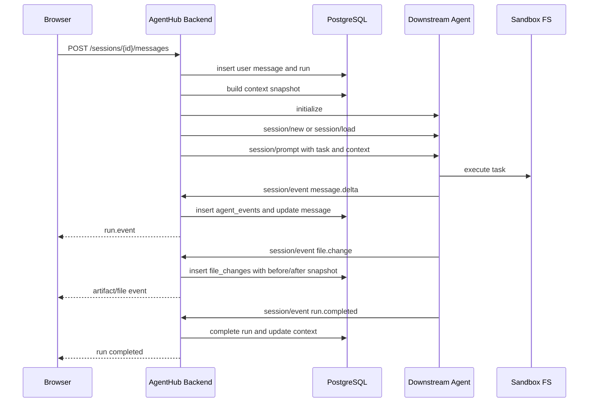

# AgentHub 与下游 Agent 对接设计

版本：v0.1  
日期：2026-05-26  
关联总方案：[agenthub-technical-design.md](./agenthub-technical-design.md)  
参考文档：`D:\xwechat_files\wxid_3pyea2k6txcl22_ee3f\msg\file\2026-05\north-acp-client(1).md`

## 1. 文档目标

这份文档专门描述 AgentHub 后端与下游 Agent/Orchestrator 的对接方式。目标是让双方可以按同一份契约联调：

- AgentHub 后端工程师知道 Bridge、adapter、落库、ack、重连、上下文注入怎么实现。
- 下游 Agent 团队知道需要提供哪些连接入口、JSON-RPC 方法、流式事件、文件快照和 artifact 上报格式。

第一版采用单用户、单后端、多 Agent 实例。所有落库操作都在 AgentHub 后端完成，下游 Agent 不直接访问 AgentHub 数据库。

## 2. 角色与责任

### 2.1 AgentHub 后端

AgentHub 后端负责：

- 主动连接下游 Agent endpoint。
- 初始化协议连接。
- 为 AgentHub session 创建或加载下游 session。
- 在发送 prompt 前构造 context snapshot。
- 调用下游 `session/prompt` 或 `run.start`。
- 接收下游流式事件。
- 对事件做幂等落库。
- 派生写入 messages、file_changes、artifacts、context_items。
- 广播给前端 WebSocket。
- 返回 ack 给下游 Agent。

### 2.2 下游 Agent

下游 Agent 负责：

- 暴露 AgentHub 可主动连接的 endpoint。
- 接收初始化、session 创建、session 加载、prompt、cancel 请求。
- 在云端沙箱中真实执行任务。
- 把过程输出、工具调用、文件变更快照、artifact、完成或失败事件上报给 AgentHub。
- 保证同一个 run 内事件 `seq` 单调递增。

### 2.3 云端沙箱

云端沙箱是下游 Agent 的执行环境：

- 真实代码文件位于沙箱文件系统中。
- 第一版 AgentHub 不直接读取沙箱文件。
- 下游 Agent 必须把展示和持久化需要的文件快照、patch、artifact 主动上报。

## 3. 对接总览



## 4. 协议 profile 决策

当前下游文档定义的是 Socket.IO + JSON-RPC：

```text
Socket.IO path: /socket.io
Socket.IO namespace: /acp
event: acp:message
JSON-RPC: 2.0
```

因此第一版建议实现 `north-socketio-jsonrpc` profile，作为真实对接优先路径。

同时保留 `agenthub-wss-json` profile 作为长期协议草案和 mock agent 的可选实现。这样做的原因是：

- 当前下游已有 North ACP Client 文档，应优先兼容。
- Socket.IO JSON-RPC 适合快速联调 request/response。
- 下游文档没有定义完整流式事件，需要 AgentHub 补一层统一 `session/event` 契约。
- 后端通过 adapter 屏蔽 profile 差异，上层业务不关心传输细节。

## 5. 后端模块细拆

### 5.1 AgentConnectionManager

职责：

- 根据 `agents.protocol_profile` 选择 adapter。
- 维护 `agent_id + agent_instance_id` 到连接对象的映射。
- 避免同一个 Agent 实例重复建连。
- 处理连接状态：connecting、connected、closed、failed。
- 把连接状态写入 `downstream_connections`。

接口建议：

```ts
interface AgentConnectionManager {
  getConnection(config: DownstreamAgentConfig): Promise<AgentConnection>;
  closeConnection(agentInstanceId: string): Promise<void>;
}
```

### 5.2 ProtocolAdapter

职责：

- 把 AgentHub 内部命令转换为下游协议消息。
- 把下游协议消息转换为 `NormalizedAgentEvent`。
- 处理 JSON-RPC request/response id 映射。
- 处理 ack。

接口建议：

```ts
interface ProtocolAdapter {
  initialize(): Promise<InitializeResult>;
  createSession(input: CreateDownstreamSessionInput): Promise<CreateDownstreamSessionResult>;
  loadSession(input: LoadDownstreamSessionInput): Promise<void>;
  prompt(input: PromptInput): Promise<PromptAcceptedResult>;
  cancel(input: CancelInput): Promise<void>;
  onEvent(handler: (event: NormalizedAgentEvent, ack: AckHandle) => Promise<void>): void;
}
```

### 5.3 DownstreamSessionManager

职责：

- 管理 AgentHub session 与下游 session 的绑定。
- 新会话第一次发给某 Agent 时调用 `session/new`。
- 后续同一个 AgentHub session 继续发给同一 Agent 时调用 `session/load`。
- 写入和读取 `downstream_sessions` 表。

绑定粒度：

```text
agenthub_session_id + agent_id + agent_instance_id -> downstream_session_id
```

这样一个 AgentHub session 可以和多个 Agent 实例分别建立下游 session。

### 5.4 RunOrchestrator

职责：

- 创建 run。
- 调用 `ContextService` 构造 context snapshot。
- 获取下游连接和下游 session。
- 调用 adapter 的 `prompt`。
- 更新 run 状态。

RunOrchestrator 不直接处理流式事件。流式事件统一进入 `EventIngestService`。

### 5.5 EventIngestService

职责：

- 校验 `runId`、`sessionId`、`seq`。
- 以 `run_id + seq` 幂等写入 `agent_events`。
- 根据事件类型派生写入业务表。
- 事务提交后广播前端。
- 落库成功后 ack 下游。

伪代码：

```ts
async function ingest(event: NormalizedAgentEvent, ack: AckHandle) {
  await db.transaction(async (tx) => {
    const inserted = await tx.agentEvents.insertIfNotExists({
      runId: event.runId,
      seq: event.seq,
      eventType: event.type,
      payload: event.payload,
    });

    if (!inserted) return;

    switch (event.type) {
      case "message.delta":
        await appendAssistantDelta(tx, event);
        break;
      case "file.change":
        await upsertFileChange(tx, event);
        break;
      case "artifact.upsert":
      case "artifact.chunk":
      case "artifact.complete":
        await ingestArtifact(tx, event);
        break;
      case "run.completed":
        await completeRun(tx, event);
        break;
      case "run.failed":
        await failRun(tx, event);
        break;
    }
  });

  await realtime.publish(event);
  await ack.ok({ ackSeq: event.seq });
}
```

## 6. North Socket.IO JSON-RPC 协议

### 6.1 连接

AgentHub 作为 Socket.IO client：

```ts
const socket = io("http://127.0.0.1:8080/acp", {
  path: "/socket.io",
});
```

所有协议消息通过 `acp:message` event 收发，消息体是 JSON-RPC 2.0。

### 6.2 JSON-RPC request

```json
{
  "jsonrpc": "2.0",
  "id": 1,
  "method": "initialize",
  "params": {}
}
```

### 6.3 JSON-RPC response

```json
{
  "jsonrpc": "2.0",
  "id": 1,
  "result": {}
}
```

### 6.4 JSON-RPC notification

```json
{
  "jsonrpc": "2.0",
  "method": "session/cancel",
  "params": {}
}
```

关键流式事件建议使用 request 而不是 notification，因为 request/response 可以作为 ack。

## 7. 初始化

AgentHub -> Agent：

```json
{
  "jsonrpc": "2.0",
  "id": 1,
  "method": "initialize",
  "params": {
    "protocolVersion": 1
  }
}
```

Agent -> AgentHub：

```json
{
  "jsonrpc": "2.0",
  "id": 1,
  "result": {
    "protocolVersion": 1,
    "agentInfo": {
      "name": "agenthub-gateway",
      "version": "dev"
    },
    "agentCapabilities": {
      "loadSession": true,
      "mcpCapabilities": {
        "http": true,
        "sse": true
      },
      "sessionCapabilities": {
        "list": {}
      }
    }
  }
}
```

AgentHub 处理规则：

- 初始化成功后把连接状态设为 `connected`。
- 保存 capabilities 到 `agent_instances.capabilities`。
- 如果初始化失败，当前 run 标记为 `failed`，错误码 `DOWNSTREAM_INITIALIZE_FAILED`。

## 8. 下游 Session 管理

### 8.1 创建 session

单聊：

```json
{
  "jsonrpc": "2.0",
  "id": 2,
  "method": "session/new",
  "params": {
    "cwd": "/workspace",
    "mcpServers": [],
    "_meta": {
      "agentId": "<agent-id>",
      "sandboxCwd": "/workspace",
      "leaderTemplateSelector": "agent",
      "sandboxTemplateSelector": "sandbox"
    }
  }
}
```

群聊预留：

```json
{
  "jsonrpc": "2.0",
  "id": 2,
  "method": "session/new",
  "params": {
    "cwd": "/workspace",
    "mcpServers": [],
    "_meta": {
      "agentGroupId": "<agent-group-id>"
    }
  }
}
```

第一版 AgentHub 主产品按单 Agent 选择实现，群聊参数保留在配置中。

Agent 返回：

```json
{
  "jsonrpc": "2.0",
  "id": 2,
  "result": {
    "sessionId": "<downstream-session-id>"
  }
}
```

AgentHub 落库：

- 写入 `downstream_sessions.downstream_session_id`。
- 绑定当前 `session_id`、`agent_id`、`agent_instance_id`。
- 保存 `cwd` 和 `_meta`。

### 8.2 加载 session

```json
{
  "jsonrpc": "2.0",
  "id": 3,
  "method": "session/load",
  "params": {
    "sessionId": "<downstream-session-id>",
    "cwd": "/workspace",
    "mcpServers": []
  }
}
```

返回：

```json
{
  "jsonrpc": "2.0",
  "id": 3,
  "result": {}
}
```

AgentHub 处理规则：

- 如果 `agentCapabilities.loadSession = true`，已有绑定时先调用 `session/load`。
- 如果 load 失败，run 标记为 `failed`，错误码 `DOWNSTREAM_SESSION_LOAD_FAILED`。
- 第一版不自动创建新下游 session 替代失败的旧 session，避免上下文错乱。

## 9. Prompt 发送

### 9.1 请求

```json
{
  "jsonrpc": "2.0",
  "id": 4,
  "method": "session/prompt",
  "params": {
    "sessionId": "<downstream-session-id>",
    "messageId": "<agenthub-user-message-id>",
    "prompt": [
      {
        "type": "text",
        "text": "请实现登录页"
      }
    ],
    "_meta": {
      "agentId": "<agent-id>",
      "agenthubSessionId": "<agenthub-session-id>",
      "agenthubRunId": "<agenthub-run-id>",
      "contextSnapshotId": "<context-snapshot-id>",
      "leaderTemplateSelector": "agent",
      "sandboxTemplateSelector": "sandbox"
    }
  }
}
```

### 9.2 上下文传递方式

当前 North 文档的 `prompt` block 只明确示例了 `type: "text"`。为减少对下游解析器的侵入，第一版建议：

- `prompt[0]` 放用户当前任务。
- `_meta.contextSnapshotId` 标识 AgentHub 后端已生成的上下文快照。
- 如果下游当前无法通过 API 拉取上下文，AgentHub 可在 `prompt` 前追加一个 text block，内容为压缩后的上下文。

上下文 text block 示例：

```json
{
  "type": "text",
  "text": "<agenthub_context>\n...pin/recent/retrieved/summary...\n</agenthub_context>"
}
```

后续如果下游愿意支持结构化上下文，建议增加 `_meta.agenthubContext`：

```json
{
  "snapshotId": "<context-snapshot-id>",
  "pinned": [],
  "recent": [],
  "retrieved": [],
  "summary": {}
}
```

### 9.3 响应

```json
{
  "jsonrpc": "2.0",
  "id": 4,
  "result": {
    "stopReason": "end_turn",
    "usage": {},
    "userMessageId": "<downstream-user-message-id>"
  }
}
```

AgentHub 处理规则：

- 收到响应代表 prompt 已被下游接受或完成一次同步调用，不能替代流式事件。
- 如果下游暂时没有实现 `session/event`，AgentHub 可以根据该响应生成一个最小 `run.completed` 事件。
- 如果已有流式 `run.completed`，该响应只作为调用结果记录。

## 10. 下游流式事件统一入口

当前 North 文档没有定义流式事件。建议下游用 JSON-RPC request `session/event` 上报关键事件：

```json
{
  "jsonrpc": "2.0",
  "id": 1001,
  "method": "session/event",
  "params": {
    "sessionId": "<downstream-session-id>",
    "agenthubSessionId": "<agenthub-session-id>",
    "agenthubRunId": "<agenthub-run-id>",
    "seq": 1,
    "type": "run.started",
    "visibility": "public",
    "occurredAt": "2026-05-26T12:00:00.000Z",
    "payload": {}
  }
}
```

AgentHub ack：

```json
{
  "jsonrpc": "2.0",
  "id": 1001,
  "result": {
    "ackSeq": 1
  }
}
```

### 10.1 通用字段

| 字段 | 必填 | 说明 |
| --- | --- | --- |
| `sessionId` | 是 | 下游 session id |
| `agenthubSessionId` | 是 | AgentHub session id |
| `agenthubRunId` | 是 | AgentHub run id |
| `seq` | 是 | run 内单调递增序号 |
| `type` | 是 | 事件类型 |
| `visibility` | 否 | `public`、`debug`、`internal` |
| `occurredAt` | 否 | 下游发生时间 |
| `payload` | 是 | 事件载荷 |

### 10.2 事件类型

| type | 说明 | 是否关键事件 |
| --- | --- | --- |
| `run.started` | Agent 开始执行 | 是 |
| `message.delta` | 文本流式输出 | 是 |
| `tool.call` | 工具调用开始 | 否 |
| `tool.result` | 工具调用结果 | 否 |
| `file.change` | 文件变更快照 | 是 |
| `artifact.upsert` | 创建或更新 artifact | 是 |
| `artifact.chunk` | artifact 分片 | 是 |
| `artifact.complete` | artifact 完成 | 是 |
| `run.completed` | run 成功完成 | 是 |
| `run.failed` | run 失败 | 是 |

关键事件必须使用 JSON-RPC request，等待 AgentHub ack 后再认为发送成功。

## 11. 事件 payload 定义

### 11.1 run.started

```json
{
  "workspaceRoot": "/workspace",
  "downstreamRunId": "agent-run-1"
}
```

AgentHub 派生行为：

- 更新 `agent_runs.status = running`。
- 写入 `agent_runs.downstream_run_id`。

### 11.2 message.delta

```json
{
  "role": "assistant",
  "channel": "final",
  "text": "我先检查项目结构。",
  "append": true
}
```

字段说明：

- `channel = final`：进入用户可见消息流。
- `channel = analysis` 或 `visibility = debug`：进入运行日志，不默认展示在主消息中。
- `append = true`：追加到当前 assistant message。

AgentHub 派生行为：

- 写入 `agent_events`。
- 追加或更新 assistant message。
- 广播前端 `run.event`。

### 11.3 tool.call

```json
{
  "toolCallId": "tool-1",
  "tool": "shell",
  "input": {
    "cmd": "pnpm test"
  }
}
```

### 11.4 tool.result

```json
{
  "toolCallId": "tool-1",
  "status": "success",
  "output": "Tests passed",
  "exitCode": 0
}
```

### 11.5 file.change

文件变更第一版以快照为主，patch 为可选。

```json
{
  "path": "src/pages/login.tsx",
  "oldPath": null,
  "changeType": "modified",
  "language": "tsx",
  "before": {
    "content": "export default function Login() {\n  return <div>Login</div>\n}\n",
    "encoding": "utf8",
    "sha256": "before-sha256",
    "truncated": false
  },
  "after": {
    "content": "export default function Login() {\n  return <button>Login</button>\n}\n",
    "encoding": "utf8",
    "sha256": "after-sha256",
    "truncated": false
  },
  "patch": "@@ -1,3 +1,3 @@\n-  return <div>Login</div>\n+  return <button>Login</button>\n",
  "stats": {
    "additions": 1,
    "deletions": 1
  }
}
```

`changeType`：

- `added`：`before.content` 可以为 `null`。
- `modified`：`before` 和 `after` 都建议提供。
- `deleted`：`after.content` 可以为 `null`。
- `renamed`：必须提供 `oldPath`。

大文件策略：

```json
{
  "before": {
    "content": "前 64KB 内容",
    "encoding": "utf8",
    "sha256": "full-file-sha256",
    "truncated": true
  },
  "after": {
    "content": "前 64KB 内容",
    "encoding": "utf8",
    "sha256": "full-file-sha256",
    "truncated": true
  }
}
```

AgentHub 派生行为：

- 写入 `file_changes.before_content`、`after_content`、sha256、truncated。
- 如果 `patch` 不存在，后端可以基于 before/after 生成只读 diff。
- 如果 `truncated = true`，前端显示“内容已截断”，不做完整文件预览承诺。

### 11.6 artifact.upsert

```json
{
  "artifactKey": "implementation-plan",
  "kind": "markdown",
  "title": "实现说明.md",
  "mimeType": "text/markdown",
  "contentMode": "inline",
  "content": "# 实现说明\n\n已完成登录页。",
  "final": true,
  "metadata": {
    "path": "docs/implementation.md"
  }
}
```

### 11.7 artifact.chunk

```json
{
  "artifactKey": "report-docx",
  "chunkIndex": 0,
  "encoding": "base64",
  "data": "UEsDBBQAAAA..."
}
```

### 11.8 artifact.complete

```json
{
  "artifactKey": "report-docx",
  "sha256": "file-sha256",
  "sizeBytes": 120034
}
```

AgentHub 派生行为：

- 合并 chunks。
- 校验 sha256。
- 上传到阿里云 OSS，并把 `artifacts.storage_kind` 更新为 `oss_object`、`storage_uri` 更新为 `oss://juzi05/{objectKey}`。
- DOCX 触发后端 HTML render。

### 11.9 run.completed

```json
{
  "finalMessage": "已完成实现，主要变更见右侧 diff。",
  "usage": {
    "inputTokens": 12000,
    "outputTokens": 3000
  }
}
```

### 11.10 run.failed

```json
{
  "code": "AGENT_ERROR",
  "message": "sandbox command failed",
  "retryable": false
}
```

## 12. 幂等、ACK 与错误处理

### 12.1 幂等键

AgentHub 以以下键保证事件幂等：

```text
agent_events.unique(run_id, seq)
```

下游 Agent 可以重复发送相同 `seq` 的事件。AgentHub 如果发现已存在：

- 不重复派生业务表。
- 仍返回 ack。
- 不把重复事件广播给前端。

### 12.2 ACK 时机

AgentHub 只有在数据库事务提交后才 ack：

```text
receive event -> normalize -> transaction insert -> derived writes -> commit -> frontend publish -> ack
```

如果落库失败：

```json
{
  "jsonrpc": "2.0",
  "id": 1001,
  "error": {
    "code": -32001,
    "message": "EVENT_PERSIST_FAILED"
  }
}
```

### 12.3 下游错误

下游请求失败时，JSON-RPC error 示例：

```json
{
  "jsonrpc": "2.0",
  "id": 4,
  "error": {
    "code": -32010,
    "message": "prompt failed"
  }
}
```

AgentHub 映射：

| 场景 | run error_code |
| --- | --- |
| initialize 失败 | `DOWNSTREAM_INITIALIZE_FAILED` |
| session/new 失败 | `DOWNSTREAM_SESSION_CREATE_FAILED` |
| session/load 失败 | `DOWNSTREAM_SESSION_LOAD_FAILED` |
| session/prompt 失败 | `DOWNSTREAM_PROMPT_FAILED` |
| Socket 断开 | `DOWNSTREAM_DISCONNECTED` |
| 协议字段缺失 | `DOWNSTREAM_PROTOCOL_ERROR` |
| 事件落库失败 | `EVENT_PERSIST_FAILED` |

## 13. 后端落库映射

| 下游事件 | 主表 | 派生表 |
| --- | --- | --- |
| `run.started` | `agent_events` | `agent_runs` |
| `message.delta` | `agent_events` | `messages` |
| `tool.call` | `agent_events` | 无，前端从事件渲染 |
| `tool.result` | `agent_events` | 无，前端从事件渲染 |
| `file.change` | `agent_events` | `file_changes`、`context_items` |
| `artifact.upsert` | `agent_events` | `artifacts` |
| `artifact.chunk` | `agent_events` | `artifact_chunks` |
| `artifact.complete` | `agent_events` | `artifacts`、OSS object、`artifact_renders`、`context_items` |
| `run.completed` | `agent_events` | `agent_runs`、`messages`、`context_items`、`session_contexts` |
| `run.failed` | `agent_events` | `agent_runs` |

## 14. 最小可跑 Mock Agent 流程

### 14.1 连接与 initialize

1. AgentHub 连接 `http://127.0.0.1:8080/acp`。
2. AgentHub emit `acp:message`：

```json
{
  "jsonrpc": "2.0",
  "id": 1,
  "method": "initialize",
  "params": {
    "protocolVersion": 1
  }
}
```

3. Mock Agent 返回 capabilities。

### 14.2 创建 session

AgentHub：

```json
{
  "jsonrpc": "2.0",
  "id": 2,
  "method": "session/new",
  "params": {
    "cwd": "/workspace",
    "mcpServers": [],
    "_meta": {
      "agentId": "mock-agent"
    }
  }
}
```

Mock Agent：

```json
{
  "jsonrpc": "2.0",
  "id": 2,
  "result": {
    "sessionId": "mock-session-1"
  }
}
```

### 14.3 发送 prompt

AgentHub：

```json
{
  "jsonrpc": "2.0",
  "id": 3,
  "method": "session/prompt",
  "params": {
    "sessionId": "mock-session-1",
    "messageId": "user-message-1",
    "prompt": [
      {
        "type": "text",
        "text": "请修改登录页按钮文案"
      }
    ],
    "_meta": {
      "agenthubSessionId": "agenthub-session-1",
      "agenthubRunId": "agenthub-run-1",
      "contextSnapshotId": "snapshot-1"
    }
  }
}
```

Mock Agent 先返回 prompt accepted：

```json
{
  "jsonrpc": "2.0",
  "id": 3,
  "result": {
    "stopReason": "accepted",
    "usage": {},
    "userMessageId": "downstream-user-message-1"
  }
}
```

### 14.4 上报事件

Mock Agent 发送 `run.started`：

```json
{
  "jsonrpc": "2.0",
  "id": 1001,
  "method": "session/event",
  "params": {
    "sessionId": "mock-session-1",
    "agenthubSessionId": "agenthub-session-1",
    "agenthubRunId": "agenthub-run-1",
    "seq": 1,
    "type": "run.started",
    "payload": {
      "workspaceRoot": "/workspace"
    }
  }
}
```

Mock Agent 发送 `message.delta`：

```json
{
  "jsonrpc": "2.0",
  "id": 1002,
  "method": "session/event",
  "params": {
    "sessionId": "mock-session-1",
    "agenthubSessionId": "agenthub-session-1",
    "agenthubRunId": "agenthub-run-1",
    "seq": 2,
    "type": "message.delta",
    "payload": {
      "role": "assistant",
      "channel": "final",
      "text": "我会更新登录页按钮文案。",
      "append": true
    }
  }
}
```

Mock Agent 发送 `file.change`：

```json
{
  "jsonrpc": "2.0",
  "id": 1003,
  "method": "session/event",
  "params": {
    "sessionId": "mock-session-1",
    "agenthubSessionId": "agenthub-session-1",
    "agenthubRunId": "agenthub-run-1",
    "seq": 3,
    "type": "file.change",
    "payload": {
      "path": "src/pages/login.tsx",
      "changeType": "modified",
      "language": "tsx",
      "before": {
        "content": "return <button>Login</button>",
        "encoding": "utf8",
        "sha256": "before",
        "truncated": false
      },
      "after": {
        "content": "return <button>Sign in</button>",
        "encoding": "utf8",
        "sha256": "after",
        "truncated": false
      },
      "stats": {
        "additions": 1,
        "deletions": 1
      }
    }
  }
}
```

Mock Agent 发送 `artifact.upsert`：

```json
{
  "jsonrpc": "2.0",
  "id": 1004,
  "method": "session/event",
  "params": {
    "sessionId": "mock-session-1",
    "agenthubSessionId": "agenthub-session-1",
    "agenthubRunId": "agenthub-run-1",
    "seq": 4,
    "type": "artifact.upsert",
    "payload": {
      "artifactKey": "summary",
      "kind": "markdown",
      "title": "变更说明.md",
      "mimeType": "text/markdown",
      "contentMode": "inline",
      "content": "# 变更说明\n\n登录按钮文案已更新。",
      "final": true
    }
  }
}
```

Mock Agent 发送 `run.completed`：

```json
{
  "jsonrpc": "2.0",
  "id": 1005,
  "method": "session/event",
  "params": {
    "sessionId": "mock-session-1",
    "agenthubSessionId": "agenthub-session-1",
    "agenthubRunId": "agenthub-run-1",
    "seq": 5,
    "type": "run.completed",
    "payload": {
      "finalMessage": "登录页按钮文案已更新。",
      "usage": {
        "inputTokens": 100,
        "outputTokens": 40
      }
    }
  }
}
```

## 15. 实施顺序

1. 新增数据库字段和 `downstream_sessions` 表。
2. 实现 `north-socketio-jsonrpc` transport client。
3. 实现 JSON-RPC pending request map。
4. 实现 initialize、session/new、session/load、session/prompt、session/cancel。
5. 实现 `session/event` normalizer。
6. 实现 `file.change` 快照落库。
7. 实现 mock Socket.IO Agent。
8. 跑通端到端：用户消息 -> prompt -> stream event -> DB -> 前端 WS。

## 16. 第一版联调验收

- AgentHub 可以主动连接下游 Socket.IO `/acp`。
- `initialize` 成功后能保存 capabilities。
- 首次发送任务能调用 `session/new` 并保存下游 session 绑定。
- 后续同 session 能调用 `session/load`。
- `session/prompt` 能携带 AgentHub run id、message id、context snapshot id。
- 下游能通过 `session/event` 上报 `message.delta`、`file.change`、`artifact.upsert`、`run.completed`。
- AgentHub 只在落库成功后 ack。
- 文件变更以 before/after 快照落库，patch 可选。
- 前端刷新后可以从数据库恢复 run timeline、文件 diff 和 artifact。
